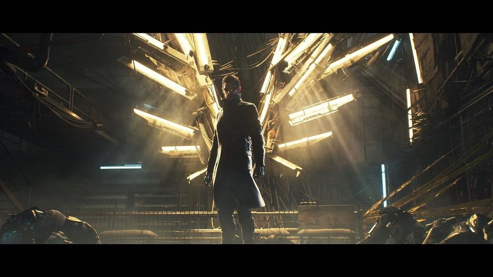
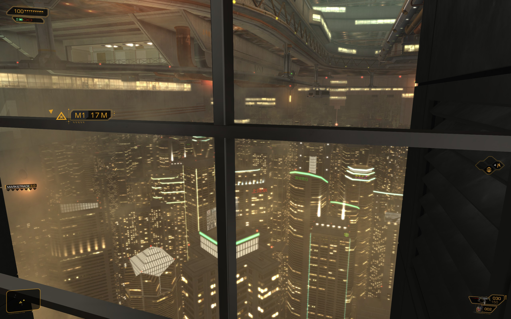
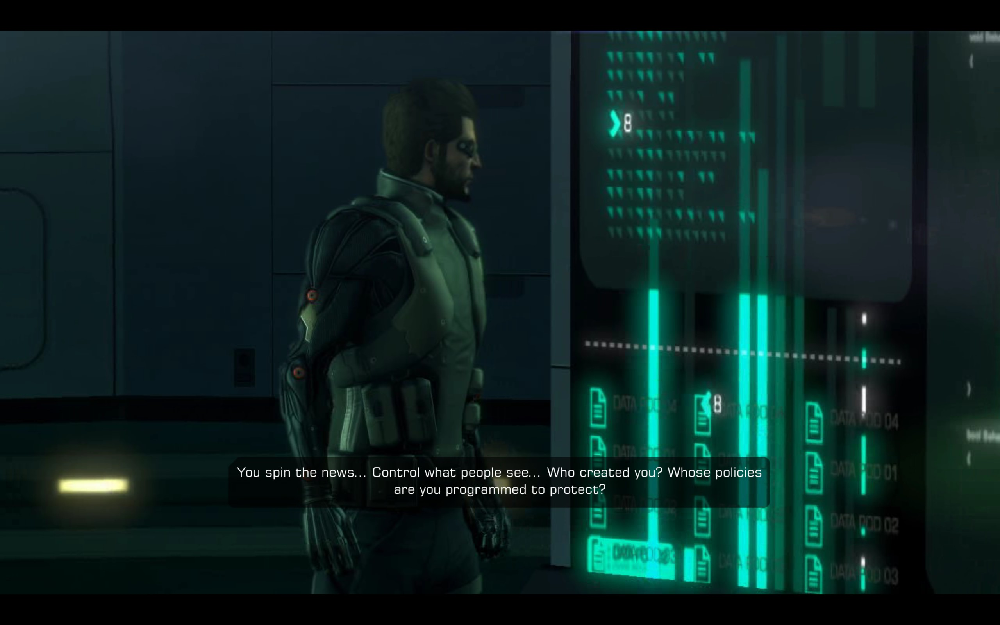
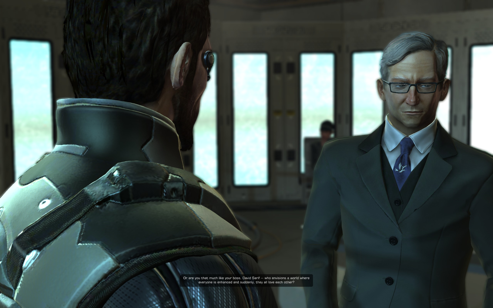
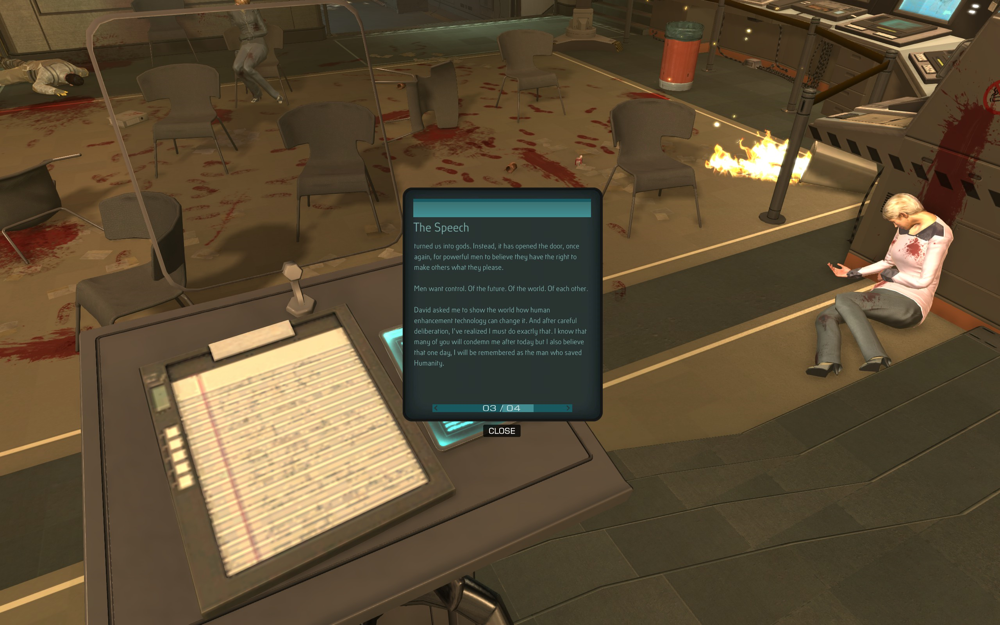

$\qquad$昨天晚上和今天凌晨又一次把游戏推到了新加坡研究所，估计再来个两三天的样子就能第二遍通关了。如果说第一遍游戏只是熟悉了操作和关卡设置，那么第二遍游戏的主要收获就是对世界观、剧情和人物对话的更深入了解。虽然后期也不怎么耐烦了，除了必要的人物对话和电脑文件、口袋助手以外什么都不看了，但是基本的世界观还是能很好地了解到的，再加上今天下午恶补了几个小时的[deus ex wiki](https://deusex.fandom.com/wiki)，算是能够梳理出比较完整的脉络来了。正好这几天事情不多（其实挺多的，主要是我太摆了，不想学习。。。五一后遗症了），就把一些思考和心得写一写，也算证明我算是**认真地**玩过这个游戏了。
$\qquad$其实剧情和攻略从上面的[deus ex wiki](https://deusex.fandom.com/wiki)上都能找到，但我感觉还是自己一点一点摸索比较有意思，这个不是本文讨论的重点，就略过不说了，反正每个boss都被我鞭尸无数次，光是变着花折腾他们就足以打发大部分游戏时光了。虽然一遍玩下来至少得20多个小时，但是在游戏里时间跨度实际上非常短，除了adam在胶囊里面睡觉花了好几天以外，剩下的事情感觉加起来也没个三四天的样子。。。但是却为我们塑造了一个相当宏伟的世界观，并且及其合理，有着极强的思想内涵在里面，这也是本文要详细探讨的内容。
$\qquad$事情的起因是21世纪初，休·达罗（以下简称达罗）因为滑雪摔断了腿，变成了残疾人，每天被禁足，就在实验室潜心研发人体增强技术，并大获成功。整个剧情就在人体增强技术的背景下展开。
$\qquad$但是不幸的是，达罗本人却因为罕见的基因缺陷，完全无法augmented，只能一直保持着残疾的肉体，无法机械飞升。而对于普通人，augmented之后只需要定期服用免疫抑制剂就可以了。当然还有一个人比较nb，他也有基因缺陷，但是这个基因缺陷却使得他对植入的机械设备不产生免疫排斥反应，于是他装上这些玩意之后是一劳永逸地受益，这个人就是这一部Deus EX的主角：亚当·杰森（下称亚当）。
$\qquad$在游戏的世界观里面没有这该死的疫情，而是在二十一世纪初期产生了巨大的科技进步，包括人类增强技术在内。人类增强技术的普及使得人类第一次距离神明如此接近，拥有了神的本领。但是随之而来的就是人类对这种技术的滥用：想想这个技术多么nb吧！强化满的杰森挨几十发子弹都死不了，随便吃点hypostim就能瞬间150血，一个台风爆炸周围变成无人区，溜到条子身后按Q还能直接不费一枪一弹地暗杀他，从楼上跳下来一点事也没有，跑步飞快还能跳9m高，不怕毒气不怕电击还能完全隐身，甚至能随便黑入人家的电脑，操纵不知道是谁家的炮台和机器人为自己服务。这就是神啊！如果一个世界的所有人都变成了这样，那这个世界也就没谱了。果不其然，人类之间开始出现大量暴力行为，等级高能力强一点的人类就能称霸一方，然后就是政府权威的衰落，国家的名存实亡，城邦的建立，以及资源的超级垄断和贫富差距的急剧加大，在上海，人们干脆在几百米的高空又建立了一个平台，人为把城市分成了上下城，下城的天空就是上城的地面。这是从下城和上城之间的电梯里看到的景象：

$\qquad$人类增强技术显然成为了人类一项必不可少的技术，在这项技术崛起的初期，很多公司都竞相成立来角逐市场份额，其中顺利做大的就是亚当的老板David Sarif（下称萨里夫）手里的萨里夫工业集团和北大才女赵云如手里的泰永制药（没错，总部在上海），这这两家都掌握着人类增强技术，互为竞争关系。
$\qquad$人类增强技术会给人类带来什么？游戏里的报纸已经为我们展示了这个混乱的世界。秩序的瓦解显然不是人类社会应有的样子，“绝对的自由也等价于绝对的混乱”。而在这一切开始之前，人类社会的一些精英人群就已经预料到了这样的变动趋势，这些人有一个组织，叫做“光明会”（Illuminati），这个组织似乎是中世纪流行的，但是竟然在这个社会又一次出现了，实在是令人惊讶。它的目的是将人类社会的走向掌控在这个组织手里，它相信人类社会需要秩序，需要管理，而不是放任自由地发展，它致力于建立人类社会的秩序。他们相信人类具有劣根性，而且无数次试验也验证了这点。所以在人类增强技术诞生之后，他们一直试图将这项技术垄断，让它不被全人类滥用造成社会的崩溃。这个光明会的成员都是些什么人呢？包括了达罗、赵云如和后面亚当要面对的大部分敌人。这个组织的影响力之广，已经渗透到各行各业，bell tower这个雇佣兵组织就是它的打手。
$\qquad$说了这个组织的初衷，是不是觉得这个组织是一个对人类有益的团体呢？那就大错特错了。因为它为了达到目标不择手段，换句话说，它的成员真的用身体践行了“人和人不一样”的信条，只有他们才是人，剩下的都是生杀大权掌控在他们手里的蝼蚁！（这怎么和《罪与罚》里面拉斯柯尔尼科夫的观点很像呢……）我们知道人生而平等，就算我们有着各种不可弥补的差距，比如身高、智商、长相等等，但是无论如何都不能防碍对我们的一视同仁。但是这个组织不一样，它认为人类是需要阶级的，是需要这种绝对的不平等的，而且这种阶级应该始终保持着纯洁性，甚至会形成一种垄断世袭的状态，就有点像阶级固化的极端情况一样。精英阶级少而精，垄断着几乎所有高级科技，控制着人类社会的走向。为了达到他们理想的社会状态，是不惜任何代价的，毕竟平民只是他们操纵的傀儡而已。
$\qquad$我们来列举一下这个组织干过的“光明事迹”吧。首先为了垄断人类增强技术，它们可是花了一番大功夫。首先由于达罗和赵云如都是其成员，有着相同的信仰，所以唯一的障碍就是萨里夫了。说真的，萨里夫真的可以称作是这个游戏里面最纯洁的人了，因为他也就是一个彻头彻尾的大资本家而已（笑）。他开公司是因为看到了这个新风口，然后凭借自己的努力做大了公司，也没有什么阶级的观点，只要你愿意买我就卖给你增强设备，他私自和Megan Reed通气研究亚当的缺陷基因也是为了寻找普及这种基因的方法，使得人类增强技术能够被更多担心免疫抑制剂不够用而不敢augmented的人群所接受，自己能够赚到更多的钱。关于萨里夫的更多讨论留到后面，先继续说光明会。光明会首先对萨里夫软磨硬泡，但是萨里夫不接受它们的观点，不愿意加入光明会帮助他们助纣为虐，毕竟他只是个资本家而已，只是想多来点客户多赚点钱罢了，搞什么阶级论除了让自己客户变少以外没别的好处。所以光明会就急了，直接动手，bell tower手下暴君小队三人（就是那三个boss）直接闯进位于底特律的萨里夫工业的研究所把科学家都抢走了，还把作为保安头子的亚当打成了致命伤，让萨里夫给他直接机械飞升。毕竟科学家一走，萨里夫工业就没法继续科研了，新的技术也就彻底回到了泰永制药手里。但是就算这波过去了，萨里夫还是不愿意加入光明会，于是光明会开始玩阴的了：
$\qquad$光明会这帮人确实无愧于精英的称号，就是可惜脑子没用到正道上。为什么这么说呢，因为他们为了实现对人类增强技术的垄断，竟然能想到偷偷组建一个极端反人类增强技术的恐怖组织，叫Humanity Front人类前线，这个组织就是杀杀杀，通过暴力冲突和抗议来反对政府的政策和萨里夫工业，他们闹起来的街道上那是一个混乱。你看，他们虽然支持人类增强技术，但是却能想到用这个阴招来把这项技术垄断在自己手中，而让自己的所有其他竞争对手架不住抗议和袭击而投降，这波自导自演，我给满分。当然他们还更nb点，指派William Taggart（下称塔加特）这个政客作为人类前线组织的领导，因为他的妻子，一名医生，被一个精神有问题的增强人给杀掉了（这本身就是一个暴力伤医事件而已，却给塔加特自身的极端反抗行为带来了极大的合理性。这波真精彩。不过也可以看出，就算到了那个时候，暴力伤医竟然还是个问题）。然后还安排了这个塔加特在参加一次会议时被暗杀掉，这样可以塑造他的殉道者的形象（当然暗杀被成功阻止了，因为知道光明会丑恶真相的人肯定不愿意让他们得逞，这些人的群体也是后面再说）。还能泼脏水给萨里夫工业这样的目标，直接让舆论把他们毁掉。哦对了，这拨人还垄断了全世界的媒体，无论你到哪里都只能看见Picus Group的新闻报导，而这些报道是被扭曲过的，“只让民众知道我们想让他们知道的”——亚当在Picus集团的地下室杀死二Boss佛多洛娃之后Picus的负责写新闻的AI就是这么说的。于是光明会已经把所有能够引导世界向着他们想要的方向发展的媒介都垄断了，可见这个组织是多么的毒瘤。而且还有重要的一点，这个组织要求成员不能说出它的存在。所以鲜有外人知道这个组织的存在，民众在错误的视听中就更看不出来其中的阴谋了。（我没有恶毒的政治隐喻，真没有，这是游戏的背景设定，如有雷同纯属巧合！）

$\qquad$除了上面这些措施之外，光明会还加了最后一重保险，那就是和泰永制药打了招呼，在他们生产的所有芯片里面加入了广播接收单元，这样只要光明会的人愿意，就可以随时广播信号给全世界的增强人，然后直接让他们的增强设备失灵。所以你在游戏里会看到Picus的新闻说老的芯片出了bug，请大家去LIMB诊所更换新的，如果你真去换了，那就上了光明会的当，然后在对付Namir时就会丢掉所有增强功能，只能拿着枪嗯打。这个芯片的作用就是在未来光明会获得了全球垄断之后，如果哪天人们想反抗，那么这个遥控就将直接断了他们反抗的根基，一群血肉之躯怎么能打败增强人类呢！所以光明会属实是把阶级斗争给玩明白了，不仅能创造出阶级分化来，还准备好了面对底层人民的反抗，真的是一群“社会精英”啊。
$\qquad$而光明会这帮son of bitch不把人当人看主要体现在亚当随着剧情深入而深入bell tower的基地所发现的一切秘密。在这个时代，科技的极大进步也需要计算机的支持，而摩尔定律显然已经走到了尽头，所以人类开始思考前沿交叉学科能否帮助计算机发展。在亚当和一位负责hylon主机的科学家的对话中，我尽力听出来的是（纯英文对话，我真的会谢），科学家意识到人脑具备计算机不具备的非并行的计算能力（后面看wiki上说人脑还具备强大的存储能力、复杂的神经网络带来的自主意识能力），于是学界试图融合人脑和计算机。但是这种研究有着极大的危险性（谁愿意给自己安上脑机接口然后被电脑当作cpu和内存来折腾？），实验人员死亡率很高，于是被官方禁止了。但是光明会就不一样了，他们又不在乎被试者的生命，只在乎这种计算机是不是真的很nb，于是他们暗地里继续开展研究，而这项研究由于本身是作为和bell tower合作探索强化人能否利用新的超级计算机来增强他们战场上的反应力的，所以研究所也就顺理成章建立在了bell tower的秘密海底基地里。在亚当探索这个基地时，看到的种种惨状是真实的激怒我了，这也是我在这个游戏里面最生气的地方——与这个实验有关的所有人都应该下地狱！他们从世界各地绑架无辜女性来这里，对她们进行手术，给她们植入可以和电脑交互的脊柱和大脑部件，然后套上专门的散热用的衣服，变成一具具“寄生虫”，就像电脑的耗材一样，用的时候放到电脑的底座里面连接上，不用了就拔出来放回仓库里冻着。这种手术的死亡率极高，且就算活过了手术，自我意识也基本丧失殆尽，并且被禁锢在专用服装里，无法活动，被电脑利用的感觉更是生不如死。但是这种计算机确实很厉害，而且被用在了很多地方，比如计算空间站的行为，计算panchaea岛的海水压力等等，也被用在与全世界的增强人类的info link交互，这也导致了后续剧情里面赵云如试图控制hylon主机来控制全世界的强化人。
$\qquad$其实整个游戏基本都是光明会整的活。他们绑了亚当的npy，然后亚当就去找她们，在一路上顺便揭开了所有阴谋的真相，然后找到了，发现自己被绿了。随着所有的敌人都被你手刃了，AI会让你做出选择，告诉民众一些东西，然后结束游戏。要说这个游戏的点睛之笔，那就是最后的选择了。玩家要选择一种文案广播给全世界，来引导民众的思想，并决定人类的未来。这三种选择是最值得回味的，因为我经过很久的思考，也没有彻底给它们分出优劣来，甚至有点相信，无论选择如何，结局或许都是一样的。
$\qquad$首先说说都有什么选择。一共有三个人会给你选择，你不能自己创造新的选择。这三个人分别是休达罗、萨里夫和塔加特。在详述这三个人的建议之前，先要讲讲亚当会在panchaea岛上遇到些什么。
$\qquad$这个故事还得从休达罗说起。这个人虽然发明了人类增强技术，自己却没法因此而得到飞升。眼看着他人都得益于这种技术，人类社会被这项技术造福而自己却无福消受，他内心变得日益扭曲。他只是想让自己能够变成正常人，那既然这项技术只能让自己离“正常人”越来越远（别人能被增强，能力更强了，但是他却依旧原地踏步），那么这项技术于他而言就是祸害了！于是他产生了阴暗的想法，正好借光明会修改芯片结构的机会，利用自己增强人之父的知识储备上的优势偷偷地在芯片上又做了手脚，给芯片又加了个功能——一旦休达罗启动另一个广播，那么芯片会发出让人失控的信号，所有植入此芯片的增强人都会变成丧尸，失去意识而互相攻击。在亚当干掉纳米尔之后，也是达罗启动这个广播的时候，于是亚当为了关掉广播拯救人类来到了panchaea岛，与达罗对峙并说服他给了自己电脑的密码，关掉了广播。但是这一切只有你知道，而panchaea岛位于南极洲冰面上，没有任何消息可以传出去。所以全世界都见证了一起没有原因的大动乱，死者以百万计。随着所有增强人恢复理智，全世界都在关注着增强技术之父达罗所在的panchaea岛，想知道事情究竟是怎么回事。
$\qquad$如果你选择按照休达罗的意愿广播，那么你将会把整个事件的几乎所有真相都告知于天下（除了达罗黑暗的想法，毕竟达罗也是个老油条了。达罗的目的达成了，但是达罗本人已经不再是探讨的重点了）。全世界都将知道光明会这个组织的存在，知道他们做过哪些恶，知道他们为了确保自己对全人类的控制而在芯片中加入广播机制，将所有增强人都控制在自己手里，也知道他们不愿意让这种技术进入普罗大众中去，而是将这种技术作为他们能够控制人类发展的工具。毫无疑问一旦这种广播被公之于众，那么光明会将会瞬间成为众矢之的，但是民众也不敢动真的，毕竟谁会知道光明会除了改芯片以外会不会再留个别的后手呢，所以大家都会意识到所有的人类增强技术都是极其危险的，因为在我们看来这就是一个黑盒子，你只知道在正常情况下这个东西能给你带来增强效果，但是你也不知道其中的机理，玩意还有什么自毁装置等待激活也是极有可能的，你要是和八月事件一样又变成僵尸了那不就寄了。所以在八月事件里面存活下来的人会立刻自己拆除增强装置，虽然可能要忍受终身残疾，而没有augmented的人们则再也不会接受增强手术了，因为谁会愿意把自己的命运交给一群和自己利益不相同的疯子来控制呢？所以可以预见的结局就是人类增强技术将会被彻底废除，人们将回归到传统的社会来，不再往这个方面继续发展。
$\qquad$如果按照塔加特的意愿广播，那么亚当会转移民众的注意力，告诉他们是免疫抑制剂的质量不好导致了这场灾难，所以我们应该更加严格地控制这种药的制造，也就是将制造权力垄断到光明会手中。于是光明会会顺理成章地控制全人类，在一个等级秩序森严的社会里继续发展。
$\qquad$如果选择按照萨里夫的意愿广播，那么亚当会把锅甩给人类前线组织，说是他们搞的鬼。这样会把民众的视线转移到他们身上，民众会忘掉自己对人类强化技术的怀疑，毕竟互联网是没有记忆的。萨里夫想骗大家说增强人失控是软件问题，是那个sb组织写的病毒造成的，所以我们要把他们给端了，然后开发杀毒软件、继续加强人类增强技术的安全性。这和达罗想让大家知道的真相是不一样的，区别就在于萨里夫把它歪曲成了软件问题，而实际上这是个硬件问题，不是简简单单加个杀毒软件就能解决的，而是需要彻底拆除才能一劳永逸地消除威胁。做个比喻，MIUI13内置国家反诈中心APP，人们注意到这一点，但是由于大家有各种方法绕过去这个APP，所以小米手机销量也没受到太多影响。但是三星手机能爆炸，这个你能绕过去吗？唯一的选择只有不去购买三星的手机。就是这个道理。萨里夫这个精明的资本家稍稍歪曲了事实，就巧妙地利用了人们的心理，使得达罗的愿望无法实现，还顺便一波带走了人类前线组织，给人类增强技术继续发展彻底扫清了障碍。萨里夫这个人真的是这三个人里面最为纯粹的，因为他所有的目标都是钱，dollar。他开发增强技术公司是为了赚钱，偷偷研究亚当的缺陷基因是为了赚钱，最后劝亚当甩锅也是为了让自己能更好地赚钱（以及“让更多的人能够受益于人类增强技术”，当然这只是能让自己冠冕堂皇地赚钱的借口而已）。现在我有一点倾向于选择这个广播（~~毕竟亚当也能分到不少红利啊~~），主要是因为萨里夫的观点至少最纯粹，在三种广播的结局都一样的前提下，显然是这样会更好一些。那为什么说三种广播的结局其实都是一样的呢？
$\qquad$这一切的灵感是来自于前几天看到的一个问题：“现在的时代，革命变得越来越难了吗”。其实在看到这个问题之前我就已经有了很多亲身的感受了，这个时代，革命就是越来越难了，甚至比登天还难。在一百年前，面对北洋军阀的压迫，学生们可以走到街头抗议，最坏的结局就是被抓进去关几天再出来，一旦有了流血事件那么就会演变成更加激烈地反抗，然后便是革命。但是现在这一切还可能吗？我们有着只存在于文书中的“集会自由”，想要在时代洪流中发出自己的声音得到的只能是404和小黑屋，更不要提什么上街游行了——怎么，你不想要账号就算了，连学号也不想要了？几百年前，政府只能调用军警肉搏来防御，还需要喊话来稳住学生的情绪，但是现在呢？panzer，请。在一百年前，中国同盟会在檀香山成立，可以向国内提供支援，武器上的和经济上的。但是现在呢？你入境了就是在天罗地网之下，每个探头都可能是认出你的那个，在海关就能把你捉拿归案。当然我扯这么多没有任何反动的意思啊，我只是简单地类比一下而已，只是想说明，革命这件事，在现在是越来越难了。那么我们就应该思考一下，革命革命，革的是旧时代旧制度、错误的东西的命，这是一件进步的事情，但是为什么会越来越难做呢？从上面的对比我们不难发现，使推翻旧的东西变得越来越困难的，就是科学技术的发展。**人类的科技全部沦为了强者对弱者实现控制的工具！**毫无疑问科技会造福全人类，但是先进的科技在提高全人类的生活水平的同时，也发挥了它另一面的作用：更好地巩固了统治阶级的地位。通过将顶尖科技收归国有，垄断在绝对忠诚的人手中，这个集团被推翻的风险就大大降低了，它也可以更加放肆地剥削底层人民了！就拿微博来举例吧，得益于微博，我们可以最快的知道新闻，知道世界上发生了什么，但是我们也只能看到那些统治阶级想让我们看到的东西，而看不到那些真正阴暗的事情，酝酿出反动的情绪也变得越来越难，你与别人的对话也落到了警察的监控之中，任何行动都将无秘密可言。
$\qquad$既然任何科技都在造福人类的同时，成为了统治阶级巩固统治的工具，那么为什么三个选择的结局就是一样的呢？这不是风马牛不相及的两件事吗？我是这样思考的：
$\qquad$首先从萨里夫的愿望实现开始推演。人类增强技术将不受阻碍地发展，甚至萨里夫成功地将亚当的基因提取了出来，转入所有增强人体内，让大家都免受免疫抑制药物的烦恼，人类真正变成了自己的上帝。这时候会给社会带来什么？

$\qquad$你看塔加特就是明白人。这个社会的成员难道会是相亲相爱的吗？显然不是，毕竟大家都是超级战士，谁怕谁啊。人们会因为任何小事大打出手，随手杀个人或者直接冲进警察局跟警察大战一场然后全身而退也是有可能的，而警察却拿这些满级增强人无可奈何。社会会彻底混乱，因为每个人都发现自己拥有了主宰一切的能力，这时候人类的一种本性就会出现——我们会渴望控制他人，渴望自己成为世界上的王，渴望权力。其实从这波疫情就能证实这一点，在疫情面前很多人看到曾经自己怎么努力也没法压在别人头上，而现在竟然可以以“我是志愿者，我说了算，你只能接受我的做法”为由爱干什么干什么了，于是变成了“抗疫达人”，天天欺压片区的老百姓，也不用受到什么惩罚。当然这种人在现在毕竟还是少数，可是当你真的具备了可以征服别人，骑在他们头上作威作福的能力时，这种人还能是少数吗？于是社会将加剧分崩离析，但与此同时也会重新形成新的秩序——那些在火拼中生存下来的人将具备最强大的能力，他们的联合也将形成这个社会的新的精英阶层，能够随意控制剩下的平民。这就是塔加特想要的结局——得益于这种科技前所未有的强大，在这样的时代想推翻这些人的统治也变得比登天还难，于是一个彻底固化的阶级分明的社会就将如此形成，持续非常长的时间。在这样的社会里，只有极少数人处在精英的地位，绝大多数人都处在社会底层。这样的社会是没有希望的，因为它里面的年轻人看不到自己的努力有什么用，自己拼了一辈子也实现不了阶层跃迁，无论干什么都是统治阶层的韭菜，等着被割。其实现在的社会已经是有史以来距离这个状态最为接近的社会了，只不过得益于德先生的存在，统治阶级也意识到改善民生也是延续自己的垄断统治的好方法，而民众得到了高福利和滋润的生活，也没那么向往阶级跃迁了——现在这样子也挺好嘛不是！我想这就是很多欧美国家的现状，虽然阶级固化比我国严重很多，但是得益于高福利和真正的民主，身处底层的民众倒也没什么好绝望的，至少这么躺下去也挺舒服的。干嘛要去当领导人是吧，既然这么过已经很快活了。这也正是我们所缺失的，如果既不关注底层普通人民的生活和社会保障，也想学着人家垄断财富和科技试图江山稳固，那就只能重蹈中国王朝周期律了。
$\qquad$但是任何统治都不是永远稳固的，祖安发明不出来海克斯科技，但是Slico依旧能在破旧的实验室里面搞出来微光呀。于是统治阶级的垄断又一次被打破，阶级之间再次进入战争，而得益于两边更加强大的科技，这次战争很可能以相互毁灭来收场，于是这个轮回回到了大家都一无所有的状态——这不就是达罗想要的结局吗！？
$\qquad$但是达罗的想法还是有点过于乐观和理想化了。人类会彻底地抵制增强技术这不假，但是既然hylon主机都能在世卫组织联合国什么的都明令禁止研究的情况下在bell tower海底基地里研发成功，那全面取缔人类增强技术之后，再出现一个新的光明会，再秘密投资建设一个研究基地研究人类增强技术，直到建成一支足够抵抗世界的军队然后彻底推翻现在的所有政权也是完全有可能的，甚至是必然的，只是时间问题而已。也就是说，人类的这种自废武功，只会帮助那些具有极端征服欲和控制欲的狂魔更快地控制整个世界，让人们回到极端的阶层社会中，看不到希望，被压迫和剥削。
$\qquad$好了，我的推演就是这样的，我证明了三种结局其实都是一样的，只是同一个轮回中的不同阶段而已。萨里夫的意愿是继续发展人类增强技术，然后社会必然会出现动荡和弱肉强食，进而这种科技终将成为强者奴役弱者的工具。这时的社会便是塔加特的意愿——一个极端的cyberpunk社会，科技高度发达但是底层人民受尽压榨，而极少数的精英则掌控着社会的发展方向。达罗则是快进到底层人民持枪而其与领导者同归于尽后的原始社会，然后又将开始技术革命的新的一个轮回。
$\qquad$那么就有必要往深处思考一下，这种轮回是必然存在的吗，我们就不能跳出来吗？我觉得不管是我的想法，还是游戏里面达罗、塔加特及其他光明会成员，都认为这种轮回是人类本性导致的必然结果。在这篇文章里面我为什么会花如此大的篇幅介绍光明会呢？就是因为他们意识到了技术能给人类带来的究竟是什么，这也是他们成立的一个初衷——他们意识到了这是跳不出的轮回，我们人类就是这样受到了永恒的诅咒，所以倒不如减少些流血，直接进入到cyberpunk社会。
$\qquad$在panchaea岛上，亚当在广播室找到了被困住的塔加特，面对他的建议，亚当的回答是“秩序不等于奴役regulation isn't equal to slavery”，显然亚当也知道塔加特想的到底是什么，顺从他的意愿只会形成一个被奴役的社会，而最为理想的社会应该是有秩序、人人平等的。可是这样的社会能形成吗？想不到这个游戏竟然还有着很浓重的反乌托邦色彩，毕竟这三个选项无论选哪个也不会造就这样的社会，换句话说，这样的社会根本不可能存在。为什么？达罗已经把我想说的都说了，请看这张截图：

$\qquad$这是达罗在启动所有人的芯片内的扰乱器之前发表的演说。“Men want control.Of the future.Of the world.Of each other.”这句话就把人类的本性说的很明白了。人类是贪婪的生物，无时不刻想要控制一切，想要主宰世界，控制所有人，唯我独尊。我们建立了现代文明，但是这不代表我们的本性就此改变了。任何科技的进步都使得这种control变得更加容易了，也使得社会能够因此而稳定——毕竟掌握了科技的人也变得越来越难被掀翻了。进一步来说，我们会发现，虽然“阶级斗争”永远是炙手可热的话题，我们也号称消灭了资产阶级，但是阶级这个东西真的会消亡吗？或者说，阶级的存在是不是有它的天然合理性在里面呢？为什么千百年来就没有什么国家真的消灭了阶级，实现了共产主义呢？我想，只要我们明白人类究竟是什么样的生物，就能知道阶级是这种贪婪和控制欲带来的必然结果。为了实现控制，很多人人为地制造了阶级，就像塔加特一样，利用科技垄断制造了精英阶层，实现了对世界的掌控。无论任何以建立有秩序的、人人平等的社会为纲要的党派，在尝到能够控制世界的甜头之后都会变味，于是屠龙者终成恶龙。不多说了，再说就又要说出恶毒的政治隐喻了。
$\qquad$但是就算有着这样的事实，那我们人类这个操蛋的社会就彻底没有希望了吗？倒也不必。我们没有大富大贵的命，但是依旧可以让自己过得舒服。想想欧美国家，它们的阶级分化比我们严重很多，但是为什么底层老百姓却并没有因此而怨声载道呢？人是利己的生物这没有任何问题，但是这就意味着人不能够利他吗？我现在看到网上很多咒骂别人是“精致的利己主义者”的言论都为说出这句话的人感到可悲，或者说为能够造就这个词的社会感到可悲。一个健康的社会，利己和利他应当是统一的，或者就算不统一，也至少应该是相近有重合的，而能够造就这么多的利己和利他的强烈对立的社会本身就是有重病在身的。相比外国，我们缺的是什么？我肯定不能下定论，毕竟这篇文章都是我的幼稚的想法，跟这个世界的现实差的还是十万八千里。但是我感觉任何一个时代的统治阶级都应该认识到，在一味地满足自己的控制欲的时候，不妨也着手改善一下底层人民的生活，你们少赚点钱影响不大，但是这些钱对于任何一个底层民众都是不可或缺的。人人只顾利己，社会便充满利己害人的风气，也就能说出“精致的利己主义者”这种词汇了。当这些官老爷们终于愿意体恤民情，愿意把自己的权力约束在更多人的利益之下时，这个社会才有救，统治才能长久，我们也才能跳出王朝周期律。是啊，人类历史随着科技发展而产生的轮回是不可避免的，但是如果统治者愿意付出精力改善社会，不单单满足自己的控制欲，那这个社会至少能稳定且安宁地维持很长的时间，毕竟底层人民虽然同样受到管制，但是却有着起码的自由和生活幸福，对于一个凡人来说也足够了。虽然距离我们想要的乌托邦遥不可及，但是对于人类这种污浊的生物而言这也是唯一有希望实现的事情了。
$\qquad$而作为普通人，我们没有改变世界的能力，但是也有追逐自己幸福的权利。做不到重开到北欧，咱也能在自己的一亩三分地里面找到久违的快乐和自由。莫言在五四青年节寄语说不要被大风吹倒，面对这种疾风，我们没法改变它的风向，更不能助纣为虐成为刮风的一员，但是我们可以成为风筝，在这个风雨如晦的时代也能悠然地起舞，不管风向是对是错，也不管世道有多么黑暗。
